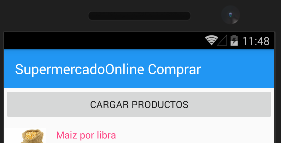

# App-Tienda
App Tienda, Xamarin MultiPlataforma (Android, ios, WindowsPhone), MVVC, en C#.

## ¿Cómo funciona?

La aplicación MultiPlataforma permite listar los diferentes productos de la canasta familiar (como se muestra la imagen), en una base de datos en Azure.

